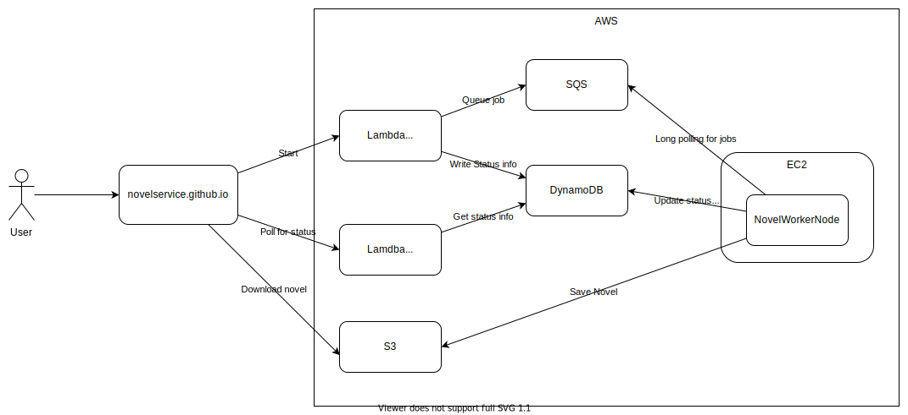

# NovelService
Novel Service allows downloading webpages and turning then into ebooks.

Visit https://novelservice.github.io

This site servers as a minimal frontend to access the backend functionality.

# Architecture
Everything is run on AWS' free tier which comes with a set of constraints.
The HTTP API runs on Lambda and is just used to trigger the worker and fetch the status.
The worker continuously polls SQS for new jobs and when receiving one, downloads the website,saves it to S3 and updates the status info with the download url.
That download url is then getting polled by the user and then the user can download the file.

## Constraints
- NovelWorkerNode is deployed inside an EC2 instance with docker compose.
Although the deployment is automated with webhook it still is janky at best.
But EC2 is free for 12 months. ECS was not chosen because it is an Amazon flavoured Kubernetes with an high learning curve (in my opinion) which is better spent on leaning 
Kubernetes.
- SQS only supports polling for messages and not subscribing to messages, but it is always free.  
- Lambda is used because the EC2 instance is already used for the worker. The alternative free compute resource is Lambda, which unfortunately brings a very high cold start latency for Kotlin/JVM. It is already optimized down to 3 seconds from 15 seconds.
